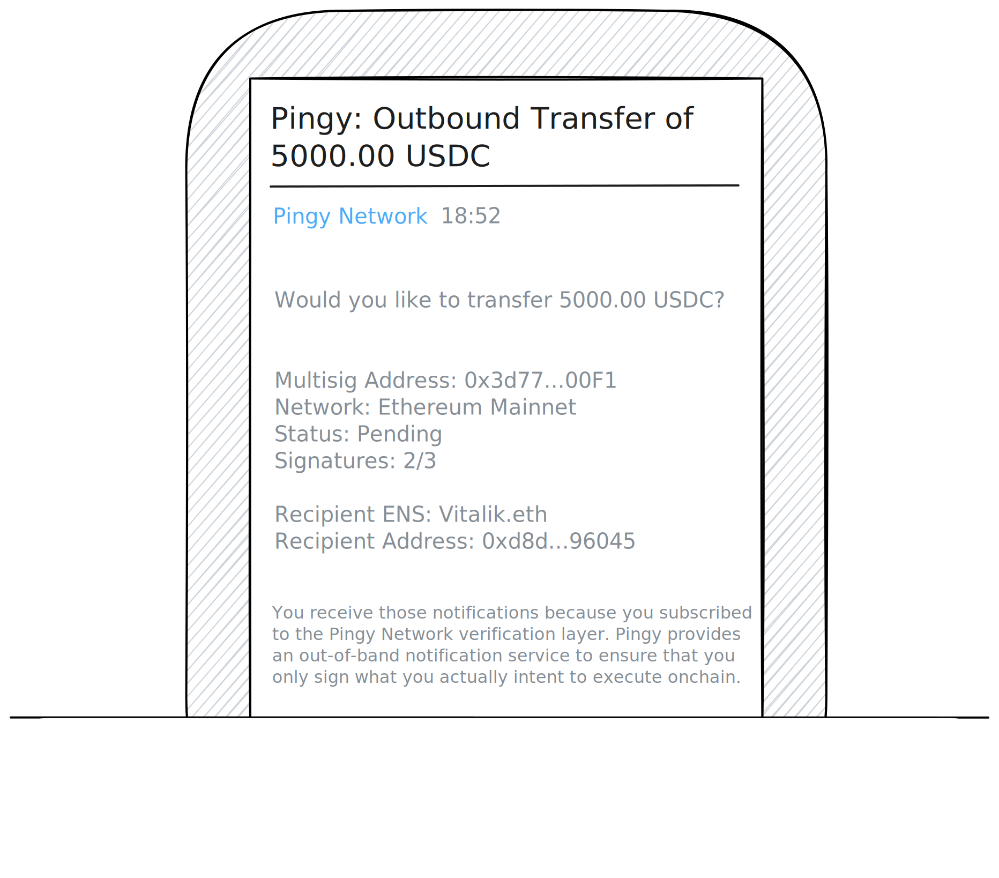

# Notifications

## Email

The first notification type to enhance your multisig security is good old Email. Pingy sends you email notifications for the signer requests that are most relevant to you. Never send the wrong amount to the wrong address ever again!

<figure><figcaption></figcaption></figure>

## Webhook

Pingy offers webhook notifications for all of your developer needs. Integrate any application into your opsec workflow and never fall victim to scammers ever again!

## Wildcard

Tell us what you need and we make sure to support your very individual onchain journey. A mobile app? Farcaster integration? Don't be shy and let us know how we can make Pingy better together!

